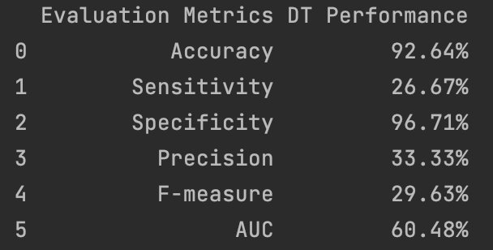

## Distribution of Biopsy Results

**Here, I show the distribution of negative and positive biopsy results in the data.**

```Python
import pandas as pd
import matplotlib.pyplot as plt
import seaborn as sns

df = pd.read_csv('cervical_risk.csv', na_values='?')

biopsy_counts = df['Biopsy'].value_counts()
biopsy_counts.plot(kind='bar')
plt.xticks(ticks=[0,1], labels=['Negative','Positive'], rotation= 1)
plt.ylabel('Count')
```


## Histogram of all the features 

```python
def plot_hist(df):
    num_feat = df.shape[1]
    num_rows = (num_feat//7)+1
    fig, axes = plt.subplots(num_rows, 6, figsize=(20, num_rows*3))
    axes = axes.flatten()
    for i, col in enumerate(df.columns):
        axes[i].hist(df[col].dropna(), bins=30, edgecolor='k')
        axes[i].set_title(col, fontsize=14)
    for j in range(i + 1, len(axes)):
        fig.delaxes(axes[j])
    plt.tight_layout()

plot_hist(df)
```


## Histogram of all the features for positive biopsy data

```Python
pos_biopsy_df = df[df['Biopsy'] == 1]
plot_hist(pos_biopsy_df)
```


## The number of null values for each feature

```Python
null_count = df.isnull().sum()
null_df = pd.DataFrame(null_count, columns=['Number of Null Values'])
null_df.reset_index(inplace=True)
null_df.rename(columns={'index': 'Feature'}, inplace=True)
null_df = null_df.to_markdown(index=False)
```


## Data Cleaning 

**The majority of the two features "STDs: Time since first diagnosis", and "STDs: Time since last diagnosis" are null values. Therefore, I drop these two features.**

```Python
df_drop = df.drop(columns=["STDs: Time since first diagnosis", "STDs: Time since last diagnosis"])
```

**The datatype for all the features is either int or float. I convert the binary variables to boolean to explicitly mark them as binary/categorical variables.**

```Python
def convert_to_bool(dfi):
    for k in dfi.columns:
        if dfi[k].dropna().value_counts().index.isin([0, 1]).all():
            dfi[k] = dfi[k].astype('boolean')
    return dfi


df_type = convert_to_bool(df_drop)
```

**The age of first sexual intercourse cannot logically be greater than the current age. Therefore, I will check for any instances of such data, and if found, I will replace the current age with the age of first sexual intercourse.**

```Python
for index, row in df_type.iterrows():
    if row['First sexual intercourse'] > row['Age']:
        print("Age of first sexual intercourse larger than current age", index)
        df_type['Age'] = df_type['First sexual intercourse']
```

**I will use the mode of the categorical variables to impute the missing values. Furthermore, given the non-normal distribution of the numerical variables, I will use the median rather than the mean to impute the missing values.**

```Python
for col in df_type.select_dtypes(include='boolean').columns:
    df_type[col].fillna(df_type[col].mode()[0], inplace=True)

df_impute = df_type.fillna(df_type.median())
```
## Basic Classificatin

**Here, I will use a Decision Tree classifier to model the basic dataset before performing any feature engineering or balancing of the dataset. I am choosing biopsy to be the target variable. Therefore, dropping the three other target variables from the dataset.**

```Python
X = df_impute.drop(['Biopsy', 'Hinselmann', 'Schiller', 'Citology'], axis=1)
y = df_impute['Biopsy']
X_train, X_test, y_train, y_test = train_test_split(X, y, test_size=0.3, random_state=42)
model = DecisionTreeClassifier(random_state=42)

model.fit(X_train, y_train)
y_pred = model.predict(X_test)
y_proba = model.predict_proba(X_test)[:, 1]
accuracy = accuracy_score(y_test, y_pred) * 100
precision = precision_score(y_test, y_pred) * 100
recall = recall_score(y_test, y_pred) * 100
f1 = f1_score(y_test, y_pred)* 100
auc = roc_auc_score(y_test, y_proba) * 100
tn, fp, fn, tp = confusion_matrix(y_test, y_pred).ravel()
sensitivity = recall
specificity = tn / (tn+fp) * 100
pre_results = pd.DataFrame({'Evaluation Metrics': ['Accuracy', 'Sensitivity',
                                                   'Specificity', 'Precision', 'F-measure', 'AUC'],
                            'DT Performance': [f"{accuracy:.2f}%", f"{sensitivity:.2f}%",
                                               f"{specificity:.2f}%", f"{precision:.2f}%",
                                               f"{f1:.2f}%", f"{auc:.2f}%"]})
print(pre_results)
```



**The low sensitivity and high specificity are expected due to the highly imbalanced data and the lower number of positive biopsy cases. This imbalance is also evident in the low precision, F1 score, and AUC.**


