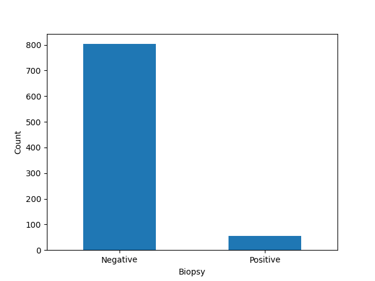
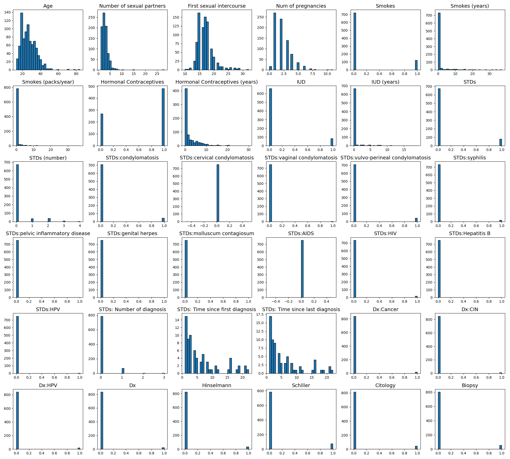
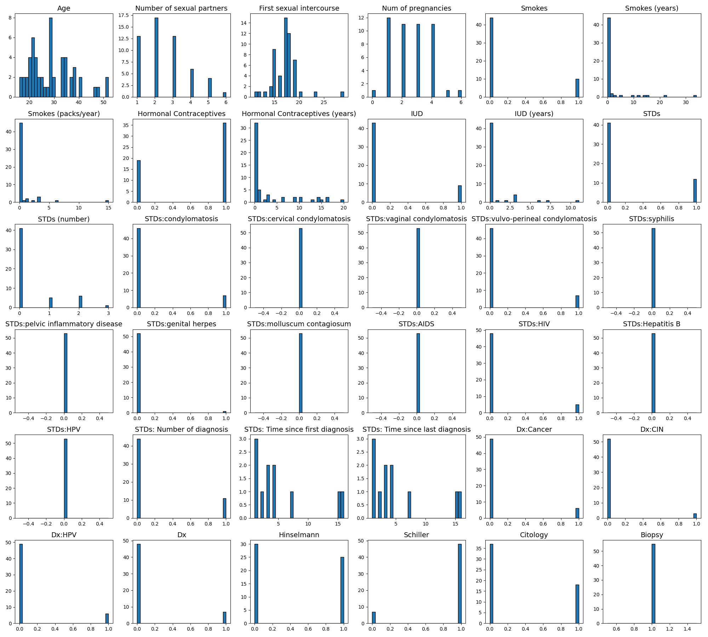

## Distribution of Biopsy Results

**Here, I show the distribution of negative and positive biopsy results in the data.**

```Python
import pandas as pd
import matplotlib.pyplot as plt
import seaborn as sns

df = pd.read_csv('cervical_risk.csv', na_values='?')

biopsy_counts = df['Biopsy'].value_counts()
biopsy_counts.plot(kind='bar')
plt.xticks(ticks=[0,1], labels=['Negative','Positive'], rotation= 1)
plt.ylabel('Count')
```



## Histogram of all the features 

```python
def plot_hist(df):
    num_feat = df.shape[1]
    num_rows = (num_feat//7)+1
    fig, axes = plt.subplots(num_rows, 6, figsize=(20, num_rows*3))
    axes = axes.flatten()
    for i, col in enumerate(df.columns):
        axes[i].hist(df[col].dropna(), bins=30, edgecolor='k')
        axes[i].set_title(col, fontsize=14)
    for j in range(i + 1, len(axes)):
        fig.delaxes(axes[j])
    plt.tight_layout()

plot_hist(df)
```


## Histogram of all the features for positive biopsy data

```Python
pos_biopsy_df = df[df['Biopsy'] == 1]
plot_hist(pos_biopsy_df)
```


## The number of null values for each feature

**The majority of the two features "STDs: Time since first diagnosis", and "STDs: Time since last diagnosis" are null values. Therefore, I will drop these two features.**

```Python
null_count = df.isnull().sum()
null_df = pd.DataFrame(null_count, columns=['Number of Null Values'])
null_df.reset_index(inplace=True)
null_df.rename(columns={'index': 'Feature'}, inplace=True)
null_df = null_df.to_markdown(index=False)
```


